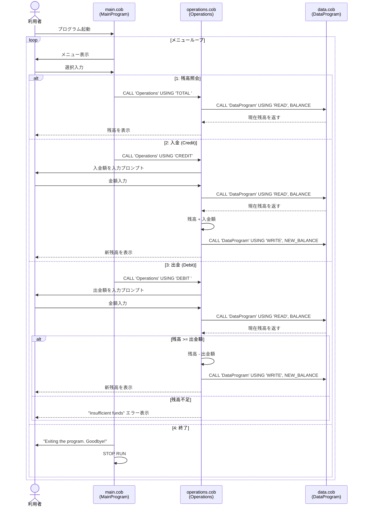

# 学校会計システム (School Account Management System)

## 概要

本システムはCOBOLで実装された学校の口座管理レガシーシステムです。
生徒・学校口座の残高照会・入金・出金の3つの基本操作をサポートします。

---

## COBOLファイル一覧と目的

### 1. `main.cob` — エントリーポイント (MainProgram)

**目的:** システムのメインループを管理し、利用者にメニューを提供するUIレイヤー。

**主要機能:**
- 対話型メニューの表示と入力受付
- 利用者の選択に応じて `Operations` プログラムを呼び出す
- 終了条件（選択肢4）の管理

**メニュー構成:**
| 選択 | 操作 |
|------|------|
| 1 | 残高照会 (View Balance) |
| 2 | 入金 (Credit Account) |
| 3 | 出金 (Debit Account) |
| 4 | 終了 (Exit) |

---

### 2. `operations.cob` — ビジネスロジック (Operations)

**目的:** 口座操作に関するビジネスルールの実装と金額計算を担うロジックレイヤー。

**主要機能:**
- **TOTAL**: `DataProgram` から残高を読み取り表示
- **CREDIT**: 入金額を入力受付し、残高に加算して保存
- **DEBIT**: 出金額を入力受付し、残高不足チェック後に減算して保存

**ビジネスルール:**
- 出金時に残高不足チェックを実施（`FINAL-BALANCE >= AMOUNT`）
- 残高不足の場合は出金を拒否し、エラーメッセージを表示

---

### 3. `data.cob` — データ管理 (DataProgram)

**目的:** 口座残高の読み書きを担うデータレイヤー。金庫・元帳に相当。

**主要機能:**
- **READ**: ワーキングストレージから現在の残高を取得して返す
- **WRITE**: 渡された残高をワーキングストレージに保存

**データ定義:**
| 変数 | 型 | 初期値 | 説明 |
|------|----|--------|------|
| `STORAGE-BALANCE` | PIC 9(6)V99 | 1000.00 | 口座残高（最大999,999.99） |

---

## システムアーキテクチャ

```
main.cob (MainProgram)
    ↓ CALL 'Operations' USING operation-type
operations.cob (Operations)
    ↓ CALL 'DataProgram' USING 'READ'/'WRITE', balance
data.cob (DataProgram)
```

---

## 生徒口座に関するビジネスルール

| ルール | 詳細 |
|--------|------|
| 初期残高 | 1,000.00 |
| 最大残高 | 999,999.99 |
| 最小残高 | 0.00（マイナス残高不可） |
| 残高不足時の出金 | 拒否・エラーメッセージ表示 |
| 入力バリデーション | 未実装（数値以外の入力は未対応） |
| 取引履歴 | 未実装（監査ログなし） |
| マルチユーザー対応 | 未実装（並行アクセス制御なし） |
| データ永続化 | ワーキングストレージのみ（プログラム終了で消失） |

---

## データフロー シーケンス図


